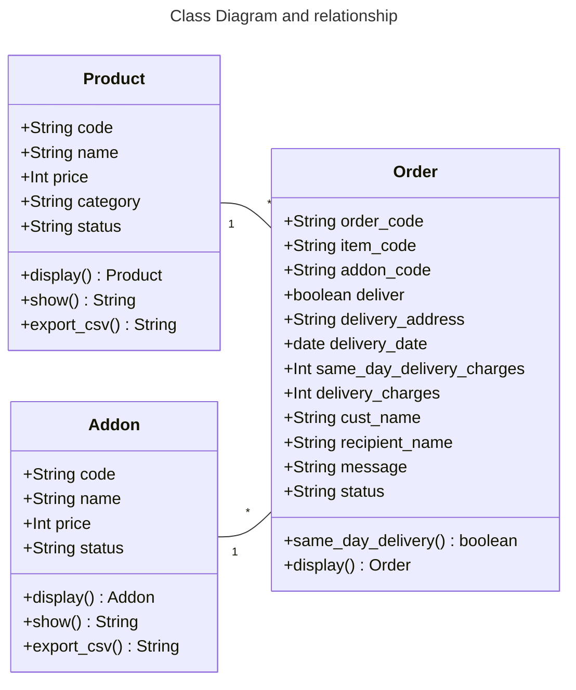

# Beautiful-Blooms
## Task 
The objective of this project is to allow students to design and implement a mini program  
  
**Language used** : Python

## Additional features that mention in the assignment question
- Using Python `Date` library
- Use Object Oriented Programming (OOP)
- Product popularity rating

## Model

